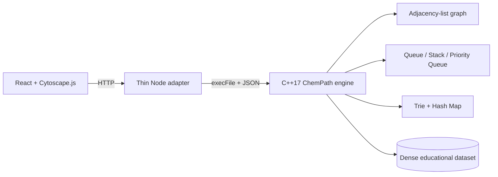

# ChemPath

**ChemPath** is an interactive chemical reaction-network explorer built as a Data Structures course project. The browser renders a dense directed network, while the graph algorithms and data-structure logic execute in a **C++17 engine**.

> **Current build:** 425 compounds, 707 reaction records and 1,778 directed graph edges, with a deliberately slowed 10-second visualization of each algorithm's C++ visit order.

## Core idea

Chemical compounds are represented as graph vertices and known educational transformations as directed edges. ChemPath lets the user inspect that graph with multiple algorithms while seeing the traversal happen step by step.

The React frontend does **not** implement the algorithms. It requests a result from the C++ engine and then replays the returned visit order over 10 seconds for presentation and learning.

## Algorithms and data structures

| Structure / algorithm | ChemPath usage |
| --- | --- |
| Adjacency-list graph | Stores 425 compounds and 1,778 directed links |
| Hash table | Compound name → integer vertex ID |
| Queue + BFS | Minimum number of reaction edges |
| Priority queue + Dijkstra | Minimum weighted reaction cost |
| Two BFS frontiers | Bidirectional path search |
| Explicit stack + DFS | Reachability exploration |
| Three-state DFS | Directed cycle detection |
| Low-link stack + Tarjan | Strongly connected components |
| Parent arrays | Path reconstruction |
| Trie | Compound/formula prefix search |

## 10-second algorithm replay

The actual C++ computation typically completes in milliseconds. ChemPath intentionally visualizes the returned traversal over **10 seconds**:

1. the current compound expands,
2. visited compounds remain marked,
3. the camera follows the active vertex,
4. the HUD shows step / visited count / elapsed time,
5. the final solution is fitted into view,
6. final reaction edges display their reaction names and costs.

This means the animation represents the C++ traversal order while still making a fast algorithm understandable during a classroom presentation.

## Architecture



## Run locally

### Requirements

- CMake 3.16+
- C++17 compiler
- Node.js 20+
- npm

On macOS with Homebrew:

```bash
brew install cmake
```

### First run

```bash
npm install
npm run build:engine
npm run test:engine
npm run dev
```

Open:

```text
http://localhost:5173
```

The Node adapter runs on:

```text
http://localhost:8787
```

### After pulling C++ changes

Rebuild the engine:

```bash
git pull
npm run build:engine
npm run test:engine
npm run dev
```

## C++ CLI

```bash
./engine/build/chempath stats

./engine/build/chempath path Methane Bicarbonate
./engine/build/chempath dijkstra Methane Bicarbonate
./engine/build/chempath bidirectional Methane Bicarbonate

./engine/build/chempath reachable Methane
./engine/build/chempath cycles
./engine/build/chempath scc
./engine/build/chempath search meth
```

## Suggested mid-sem demonstration

1. Show the full 425-node reaction network and explain the adjacency-list representation.
2. Run **BFS** from Methane → Bicarbonate and let the 10-second replay finish.
3. Switch to **Dijkstra** and explain the priority queue and weighted reaction cost.
4. Run **Bidirectional BFS** and explain the two search directions.
5. Run **DFS Explore** from Methane to show reachability.
6. Run **Tarjan SCC** to highlight a mutually reachable region.
7. Type `meth` in the compound finder and explain Trie prefix lookup.
8. Show the C++ source/tests to establish that the algorithms are not JavaScript implementations.

## Dataset limitation

ChemPath is an **educational graph model**, not a laboratory synthesis planner.

The expanded dataset combines common compounds, homologous organic series, ionic networks, aromatic examples and simplified biochemical pathways. Several edges intentionally represent generalized educational connectivity rather than complete balanced laboratory procedures. Reaction costs are illustrative graph weights used to demonstrate Dijkstra; they are **not** thermodynamic, kinetic or monetary measurements.

---

**ChemPath — watch graph algorithms move through chemistry.**
