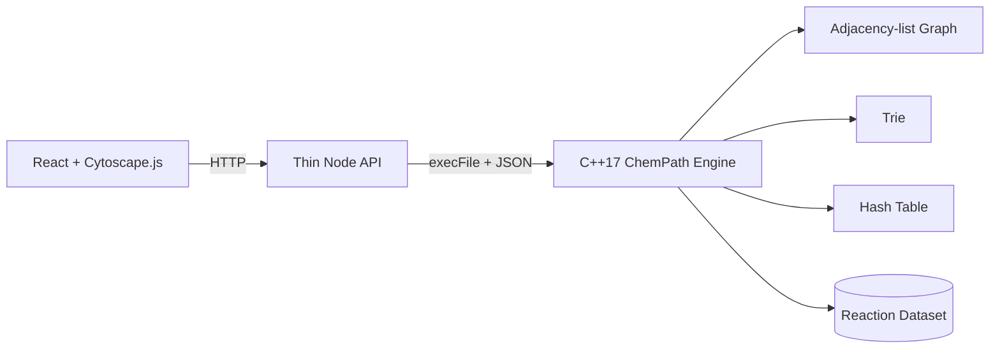

# ChemPath

**ChemPath** is an interactive chemical reaction network explorer built for a Data Structures course project. The interface visualizes chemistry as a directed graph, while the actual algorithms and data-structure logic run in a **C++17 engine**.

> **Mid-sem goal:** a working, explainable application where the frontend displays results and C++ performs graph traversal, shortest-path search, cycle detection, hashing and Trie prefix lookup.

## What it does

- Visualizes compounds as graph vertices and known transformations as directed edges.
- Finds the **minimum-step reaction pathway** between two compounds using BFS.
- Explores every reachable compound from a selected starting compound using DFS.
- Detects a directed cycle using three-state DFS / recursion-stack logic.
- Searches compound names and formulae using a **Trie**.
- Reports algorithm metrics such as visited nodes and runtime.
- Ships with a compact educational reaction dataset so every feature works offline.

## Data Structures demonstrated

| Structure / algorithm | ChemPath usage | Typical complexity |
| --- | --- | --- |
| Adjacency-list graph | Stores reaction connectivity | `O(V + E)` memory |
| Queue | BFS frontier | `O(1)` enqueue/dequeue |
| Stack | Iterative DFS frontier | `O(1)` push/pop |
| Hash table | Compound name → integer ID | Average `O(1)` lookup |
| Parent arrays | Reconstruct BFS pathway | `O(path length)` |
| Trie | Prefix-based compound search | `O(L + K)` |
| DFS state array | Directed cycle detection | `O(V + E)` |
| BFS | Minimum-edge pathway | `O(V + E)` |

## Architecture



The Node process is intentionally only an adapter. It does **not** implement BFS, DFS, cycle detection, path reconstruction or Trie search.

## Current mid-sem scope

- [x] C++ compound and reaction model
- [x] Adjacency-list graph
- [x] Hash-based compound lookup
- [x] BFS shortest pathway + parent reconstruction
- [x] Iterative DFS reachability
- [x] Directed cycle detection
- [x] Trie prefix search
- [x] Automated C++ tests
- [x] JSON CLI interface
- [x] Thin HTTP adapter
- [x] Interactive graph frontend
- [x] BFS path highlighting
- [x] DFS reachable-node highlighting
- [x] Cycle result display
- [x] Trie-backed live compound finder
- [ ] User-created reaction persistence
- [ ] Weighted reaction paths / Dijkstra
- [ ] Traversal animation timeline
- [ ] Expanded validation and larger curated dataset

## Run locally

### Requirements

- CMake 3.16+
- C++17 compiler (Apple Clang / GCC / MSVC)
- Node.js 20+ and npm

### Install, build and run

```bash
npm install
npm run build:engine
npm run test:engine
npm run dev
```

Open `http://localhost:5173`. The API listens on `http://localhost:8787`.

## Run the C++ engine directly

```bash
./engine/build/chempath stats
./engine/build/chempath network
./engine/build/chempath path Methane Bicarbonate
./engine/build/chempath reachable Methane
./engine/build/chempath cycles
./engine/build/chempath search meth
```

Example BFS pathway:

```text
Methane
  ↓ Methane combustion
Carbon Dioxide
  ↓ Carbon dioxide hydration
Carbonic Acid
  ↓ Carbonic acid dissociation
Bicarbonate
```

## Recommended mid-sem demonstration

1. Open the reaction network and explain **vertices, directed edges and adjacency lists**.
2. Search `meth` and show that the result comes from the C++ **Trie**.
3. Find a path from **Methane → Bicarbonate** and explain why unweighted BFS finds the minimum number of edges.
4. Switch to **Explore**, run DFS from Methane and highlight the reachable subnetwork.
5. Run **Cycle Detection** and explain the `unvisited / visiting / complete` states used to identify a back edge.
6. Show the C++ source and tests so it is clear the frontend is not implementing the algorithms.

## Dataset model and scientific limitation

ChemPath is an **educational reaction-network model**, not a laboratory synthesis planner.

Each reaction stores one or more reactants and products. For graph analysis, every reactant creates a directed connectivity edge to every product in that known reaction. A returned route therefore describes **network connectivity through known transformations**; it does not prove that a target can be synthesized from one isolated starting compound without co-reactants, catalysts, conditions or stoichiometric balancing.

## Course-learning outcomes

The implementation demonstrates how to translate a real domain into a graph model, choose adjacency lists for a sparse graph, use BFS for minimum-edge paths, use DFS for reachability and cycles, reconstruct a route through parent information, apply hash tables for fast name lookup, and implement Trie-based prefix search.

---

**ChemPath — Explore chemistry as a network.**
